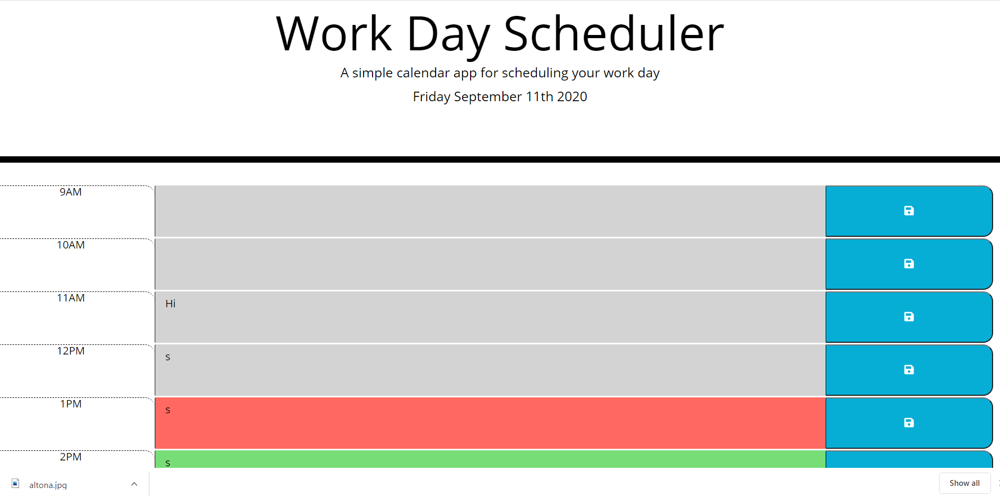

# Work-Day-Scheduler

### Descrption
This is a little app that you can use to plan out your work day. It updates you with the current date and 
and by the color of the row you can know what hour you are on. If it is green, then the hours are in the 
future, if it's red, that means it is the current hour and if it's grey, that means the hour has already happend.

### Usage
All you have to do is write in what you need to do on the times that you would like, and then hit the save button. The colour automatically changes to notify you what time it is so that you can make sure you achieve the tasks you need to.

### Tools used
I used HTML, JQuery with JavaScript, CSS and momentjs for the time parts.

### Contact Information

Email: <chris.skogstad1@gmail.com>

