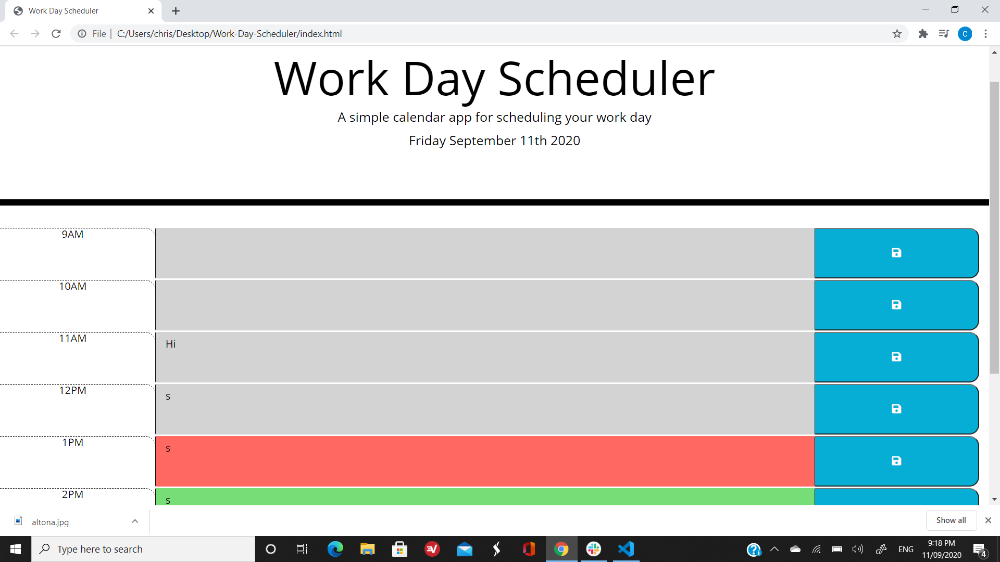

# Work-Day-Scheduler

### Descrption
This is a little app that you can use to plan out your work day. It updates you with the current date and 
and by the color of the row you can know what hour you are on. If it is green, then the hours are in the 
future, if it's red, that means it is the current hour and if it's grey, that means the hour has already happend.

### Tools used
I used HTML, JQuery with JavaScript, CSS and momentjs for the time parts.

### What I learned
I learned a lot more about using a bit of JQuery to help speed things up a bit. I also learned
how to use momentjs which was really interesting and also super handy to use because
it pretty much did all of the timing stuff for me with little work to get it to do what I wanted.
Im not totally happy with this, and I think I may re do it at some point because somethings dont work
the way I want them to and when I started doing this, I wasn't totally comfortable with generating 
content with JQuery. I have learned a lot over the past week and so when I do redo it I think it will 
come out much better.
